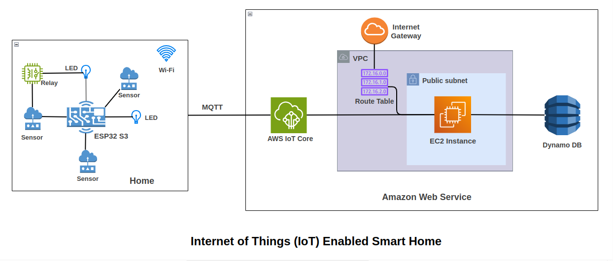
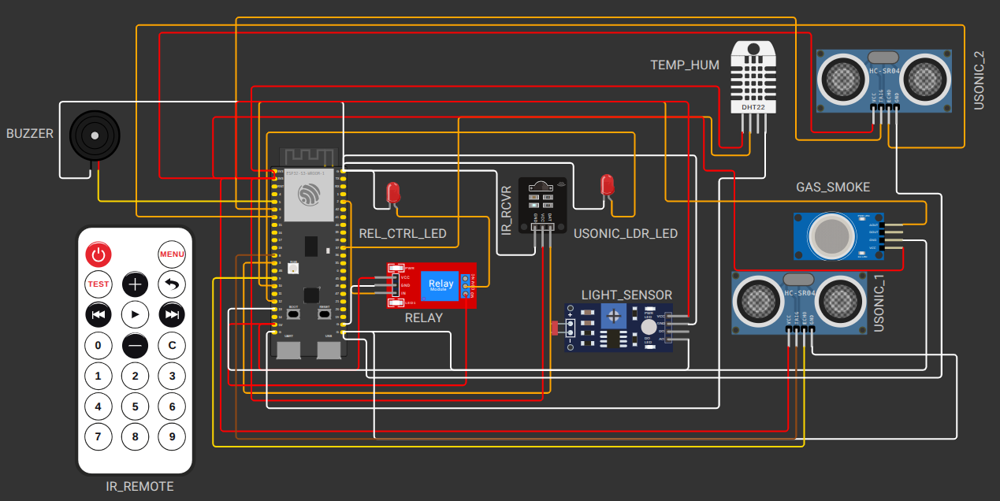
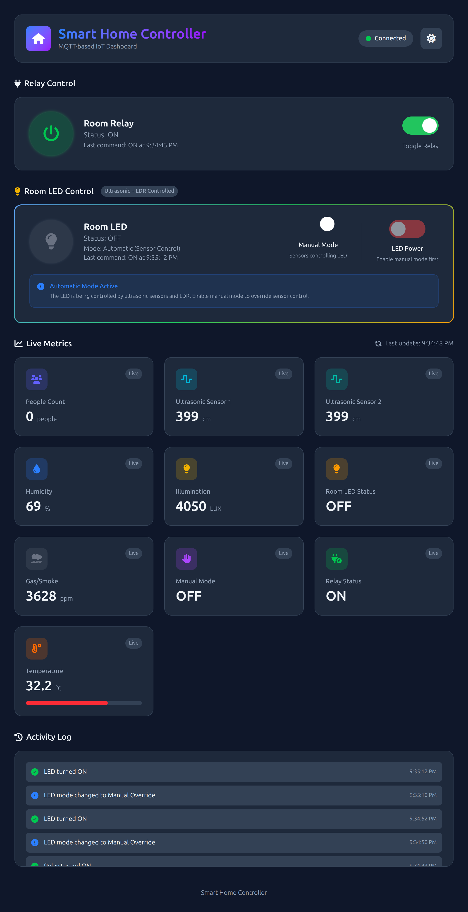
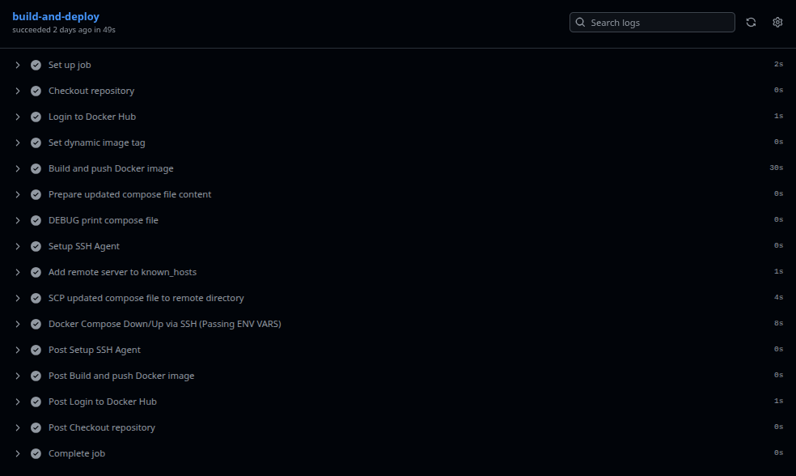
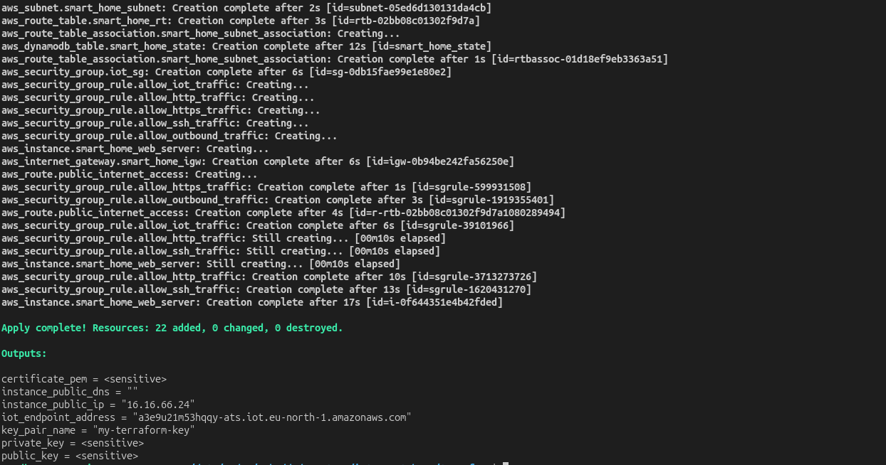

# Smart Home IoT System

This project uses an ESP32-S3 with various sensors and actuators - alongside a Go-powered backend - to form a full IoT smart home setup that runs on AWS cloud services. Instead of direct links, it relies on MQTT messaging so components can interact smoothly. Automation features are included, also enabling remote operation from any location. Occupancy detection works per room, while environmental conditions get monitored continuously. Safety warnings trigger when risks appear, ensuring timely responses. A web dashboard offers both control options and live data display.

---

## Features

### IR-Controlled Lighting

An LED responds to commands from an IR remote. When the receiver detects a signal, it switches a relay linked to the light. Alternatively, that relay may be activated through a web page.

### Room Entry Detection

A second LED serves as the primary room lighting. While one ultrasonic sensor detects entries, another tracks exits - together they count occupants. Based on occupancy, the system adjusts illumination without manual input.

* The light activates upon entry.
* It shuts down once the final individual exits.
* Occupancy tracking handles several individuals entering or exiting.
* The light operates manually or automatically, with settings adjusted through the web portal - either option works. Configuration is done online, offering flexibility depending on user preference - no physical switches needed.

### Gas and Smoke Alert

An MQ-2 unit checks air quality or detects fumes. When values go above set limits, the alarm activates.

### Temperature and Humidity Monitoring

A DHT11 sensor gives temperature, also reporting humidity levels.


### MQTT Integration

All sensor information is sent via MQTT. While the backend receives these updates, it may send instructions back to the ESP32.


### Cloud Backend

* The backend uses Go.
* A web interface created using HTML, CSS, JavaScript offers control along with visual feedback.
* Device states get saved inside a DynamoDB table from AWS.
* Interaction with the ESP32 runs via AWS IoT Core.
* All operations occur on an AWS EC2 server within a VPC.

### Automation, Infrastructure, and Deployment

* Terraform sets up the VPC alongside subnets, an EC2 instance with route tables, connects via Internet Gateway, includes IoT components, among others.

* Github Actions manages CI/CD through automated steps: it builds then pushes the Docker image, refreshes the server, also triggers a restart without manual input.

---

## Tech Stack

### Embedded Device

* ESP32-S3
* C++ (Arduino framework)
* DHT11, MQ-2, IR Receiver, IR Remote, Ultrasonic Sensors, Relay, LEDs, Buzzer, LDR

### Cloud and Backend

* Go HTTP server
* HTML, CSS, JavaScript web frontend
* AWS EC2
* AWS IoT Core
* DynamoDB stores device states along with sensor information

### DevOps and Deployment

* Terraform for Infrastructure as Code
* Docker for containerization
* GitHub Actions for CI/CD
* VPC, subnet, route tables, and Internet Gateway configuration

---

## System Architecture Overview



High-level steps:

1. The ESP32 sends sensor readings to AWS IoT Core while sharing device status updates through the same channel.

2. The Go backend listens to MQTT topics - handles incoming data while saving status into DynamoDB through sequential steps.

3. The frontend pulls live data from the backend, while also sending instructions to the ESP32 via MQTT.

4. Terraform handles infrastructure operations.

5. Github Actions runs builds, then pushes changes automatically.

---

## Simulations

### Full System (Wokwi + AWS IoT Core)

[iot-smart-home](https://wokwi.com/projects/449146269437833217)

### Demo Simulation (Wokwi + HiveMQ MQTT Broker)

Used when AWS is not required for demonstration.

[hivemq version](https://wokwi.com/projects/449061700573490177)

---

## Hardware Used

* ESP32-S3
* DHT11 sensor
* MQ-2 gas and smoke sensor
* IR receiver and remote
* Relay module
* 2 LEDs
* 2 ultrasonic sensors (HC-SR04)
* Buzzer
* LDR light sensor
* Breadboard and wiring



---

## Usage

### 1. Deploy the Backend

You can choose one of two paths:

#### Option A: Run with Docker

```
docker-compose up --build
```

Ensure the necessary environment variables have been configured:

* `AWS_IOT_ENDPOINT`
* `DDB_TABLE`
* `AWS_REGION`
* `AWS_ACCESS_KEY_ID`
* `AWS_SECRET_ACCESS_KEY`
* Certificates (`AWS_CERT_PEM`, `AWS_PRIVATE_KEY_PEM`, `AWS_ROOT_CA_PEM`)

These get sent automatically through the CI/CD pipeline when deploying to EC2.


#### Option B: Run Locally

```
cd http-server
go run .
```

Make sure to manually export identical environment settings.


---

### 2. Flash the ESP32-S3

1. Launch the project using Arduino IDE or alternatively, use PlatformIO.

2. Modify `secret.cpp` by entering your Wi-Fi details along with AWS IoT Core certificates. Use that file to store access data securely instead.

3. Transfer the program to the ESP32-S3 using a USB connection.

Screenshot of Arduino/PlatformIO upload
**[Place screenshot here]**

---

### 3. Access the Web Dashboard

Open your EC2 public URL or domain:

```
http://<ec2-public-ip>:8080
```

The interface allows users to:

* Toggle the relay
* Change the room light from manual to automatic mode using a toggle switch
* View occupancy count
* See gas/smoke alerts
* Check temp or humidity
* See live sensor information

Screenshot of web UI


---

## CI/CD Pipeline

Github Actions creates a numbered Docker image - then sends it to your EC2 server.

Steps handled automatically:

* Build and push Go backend image
* Update docker-compose on EC2
* Create a `.env` containing sensitive data
* Restart services



---

## Infrastructure

Terraform sets up all resources, such as:

* VPC
* Subnets
* Route tables
* Internet gateway
* EC2 instance
* Security groups
* AWS IoT Core configuration
* DynamoDB table
* IAM policies along with certificates

Terraform deployment steps:

```
cd terraform
terraform init
terraform apply
```



---

## MQTT Topics

### Published by the ESP32

* `myhome/sensors/temp`
* `myhome/sensors/humidity`
* `myhome/sensors/gas`
* `myhome/sensors/smoke`
* `myhome/sensors/light`
* `myhome/sensors/roomcount`
* `myhome/devices/relay/state`
* `myhome/devices/roomlight/state`

### Subscribed Commands

* `myhome/command/relay/set`
* `myhome/command/roomlight/set`
* `myhome/command/roomlight/mode`

---

## Future Improvements

* Add camera-based detection
* Add mobile app
* Add OTA firmware updates
* Add past graphs showing environmental figures

## License
This project is licensed under MIT